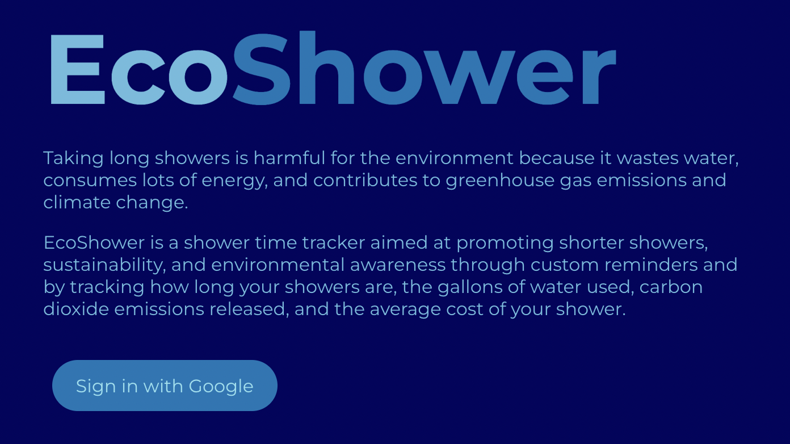
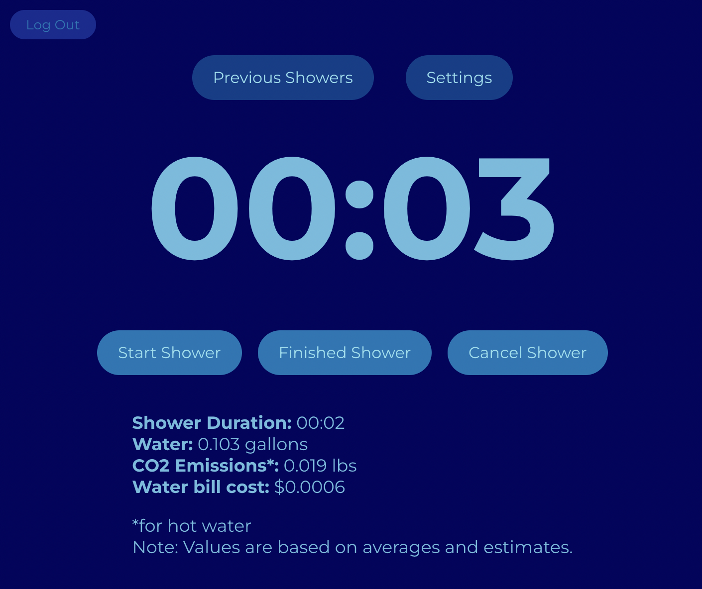
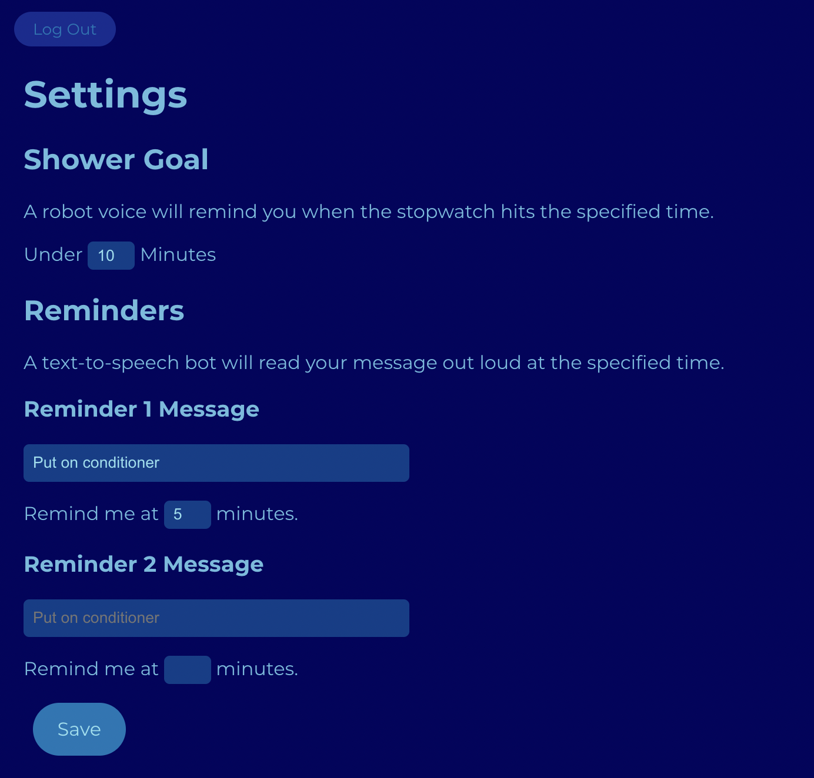
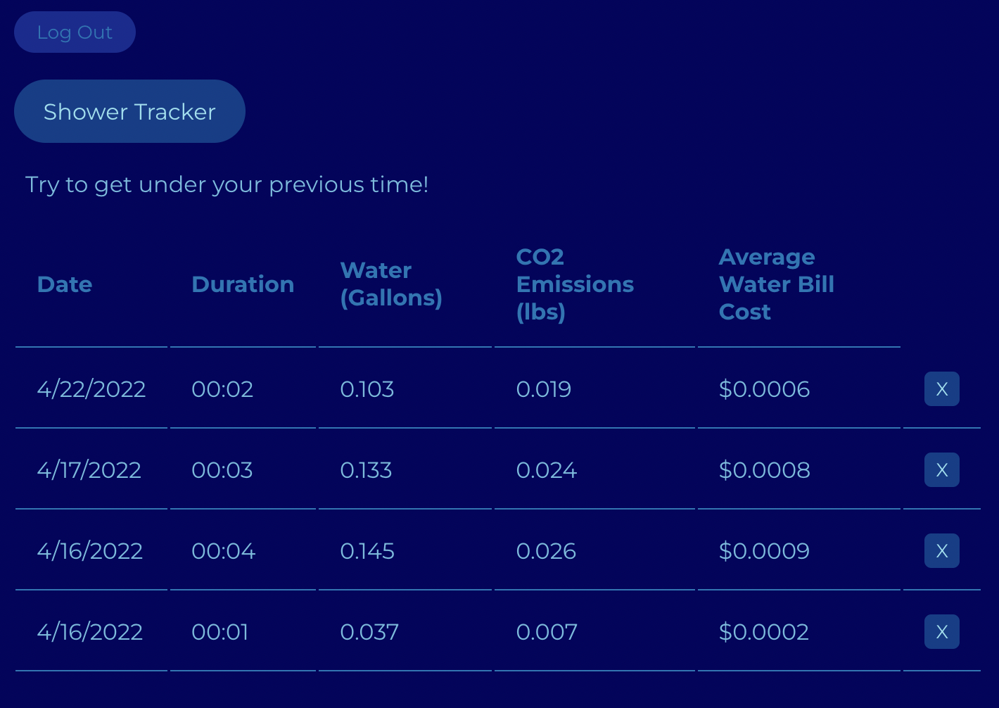

# EcoShower 🚿🌱

EcoShower is a shower tracking web app aimed at anyone who showers and wants to track the environmental impact of their showers. One of the simplest ways to live more sustainably is to take shorter showers, as long showers are harmful to the environment due to wasting water, consuming lots of energy, and worsening climate change by increasing greenhouse gas emissions (through heating the water), so Ecoshower is meant to encourage shorter showers for more sustainable living. 

The app includes a stopwatch that you start when you take a shower and stop when you finished the shower. After the shower, you can see information about the duration, amount of water used, carbon dioxide emissions (assuming the water is heated), and average water bill cost of the shower based on how long it took to shower. There is also a section where you can input in shower duration goals, as well as messages/reminders that a robot voice would say out loud during the shower (e.g. if you want to transition from using shampoo to conditioner at a certain time point) to keep you accountable and under your desired time limit. 

I made Ecoshower in a day to practice using React.js and Firebase. That's why it's a web app instead of a mobile app (because I don't have a lot of experience making mobile apps yet) despite it being better suited as a mobile app since people are slightly more likely to bring their phones to the bathroom than a computer. Maybe one day I'll turn it into a mobile app.

## Site
### Landing Page

### Stopwatch

This page has a start and stop button for when the user starts and finishes their shower. After you finish your shower, your will get environmental statistics about the shower based on how long it took.

For the calculations of gallons of water, CO2 emissions, and cost, I used the fact that average shower uses [2.1 gallons of water each minute](https://www.aquatell.ca/pages/how-household-water-usage-contributes-to-co2-emissions#:%7E:text=Showers%20and%20Baths,15%20minutes%20x%200.18%20lbs), a gallon of heated water uses [0.18 lbs of CO2](https://www.aquatell.ca/pages/how-household-water-usage-contributes-to-co2-emissions#:%7E:text=Showers%20and%20Baths,15%20minutes%20x%200.18%20lbs), and "[the average water bill in the United States is $72.93 a month for a family of four using 100 gallons of water per day per person](https://www.moving.com/tips/how-much-does-the-average-water-bill-cost/)". In the future, there would preferably be settings to adjust the water cost and more customization options.

### Settings

Here, you can set your water goal and a robot voice would remind you when the stopwatch reaches that time. You can set other reminders at custom times and a robot voice would read out your custom message during that time. However, right now, there's a bug where stopping the stopwatch before the reminder times would not stop the reminders from being read anyway.

### Previous Showers

You can view previous showers here and delete them. There is not much here yet, but it would be nice to have a summary/totals section and graphs of the data, as well as manually add showers. 

## Built With
This was built with React.js and Firebase.
